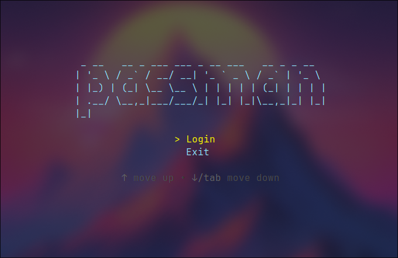

Passman
=======

A CLI/TUI application for managing your passwords and other data using SQLite and AES-256 encryption with Bubble Tea framework.

## Installation

- Download Go language.

- You can run `go install github.com/hikkiyomi/passman@latest` \
  or clone this repository and run `make`.

## Usage

### Beforehand

Passman uses a tuple of keys `(username, password, salt)` to save and identify a set of data. \
In other words, if you have passed, let's say, a tuple `("my_name", "my_password", "my_salt")`, \
you will be able to see only records that were saved under the exact same tuple.

Using this kind of tuple and SQLite makes managing your data incredibly versatile \
as you can split records to different databases and tuples.

### Passing your salt

Salt is basically your second password, so you want to keep it far away from prying eyes.

It is recommended to start Passman with passing your salt like this: \
`PASSMAN_SALT=<salt> passman ...` \
or \
`YOUR_ENV_VARIABLE=<salt> passman ... --salt=YOUR_ENV_VARIABLE ...`, \
although you can export this variable before running the application.

### Running

Passman has 2 different modes:

- Interactive

    Run `passman` to enter the interactive mode with TUI. \
    This one does not need any explanation.

    You can start interactive mode without passing the environment variable with salt \
    as it is possible to pass salt directly using TUI.

- Single command

    Run `passman --help` to get more information.

    ### Passman has the following persistent flags:

    - `-s, --salt string`. Default is `PASSMAN_SALT`. Specifies the env variable with salt.
    - `    --user string`. **Required**. Specifies the owner of the data. Basically, it is your username.
    - `    --password string`. **Required**. Your password.
    - `    --path string`. Default is `./database.db`. Specifies the path to the database.
    - `    --encryptor string`. Default is `aes`. Specifies the encryptor.

    ### Passman has the following subcommands:

    - `passman save`
        - `--service string`. **Required**. Specifies the name of the service you want to save data about.
        - `--data string`. **Required**. Specifies the data you want to save.

    - `passman get`
        - `--service string`. Specifies the name of the service you want to get data about. \
          If empty or not provided, Passman will give you every single record under your tuple.

    - `passman update`
        - `--id int64`. **Required**. Specifies the id of the service you want to update.
        - `--service string`. Specifies the new value of service name for the record. Leave empty if not affected.
        - `--data string`. Specifies the new value of data for the record. Leave empty if not affected.

    - `passman remove`
        - `--id int64`. **Required**. Specifies the id of record that you want to delete.

    - `passman import`
        - `--from string`. **Required**. Specifies the path to file to import from.
        - `--import-type string`. Specifies the type of file to import from. Can be `csv`, `tsv` or `json`. \
          If empty, Passman will try to parse the import type automatically.
        - `--browser string`. Specifies the format of importing data if the data was exported from browser. \
          Leave empty if it was not exported from browser but from Passman. \
          *Available options: `chrome`, `firefox` (case-insensitive)*.

    - `passman export`
        - `--into string`. **Required**. Specifies the path to file to export into.
        - `--export-type string`. Specifies the file type of file to export into. Can be `csv`, `tsv` or `json`. \
          If empty, Passman will try to parse the export type automatically.
